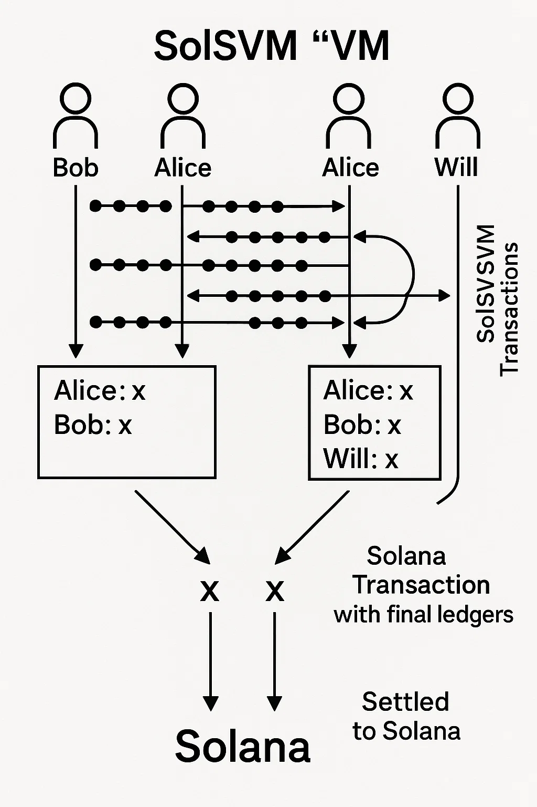

# SolSVM

I got inspiration for this project from a etherium svm i saw online so i decided to make one for solana this will make every multitransaction on solana which is already one of the cheapest and fastest block chain cheaper

SolSVM is a state channel (more specifically a payment channel), designed to
allow multiple parties to transact amongst each other in SOL or SPL tokens
OFF-CHAIN. Yes offchain. Test it locally and if you have any recommendation for features or updates or even improvments feel free to message me on twitter as  i made a special one for this project      [twitter account ](https://x.com/SolanaSVMPay).

A reference implementation of an off-chain [state channel](https://ethereum.org/en/developers/docs/scaling/state-channels/)
built using [Anza's SVM API](https://www.anza.xyz/blog/anzas-new-svm-api).

I decoupled the SVM API from the rest of the
runtime, which means it can be used outside the validator. This unlocks
SVM-based solutions such as sidecars, channels, rollups, and more. This project
demonstrates everything you need to know about boostrapping with this new API.

Below is a diagram of the SVM API.

